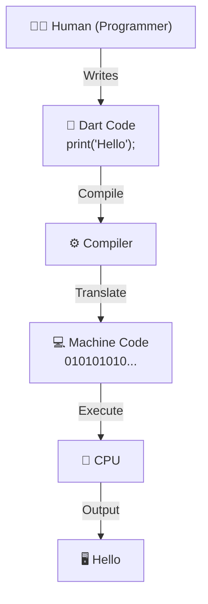
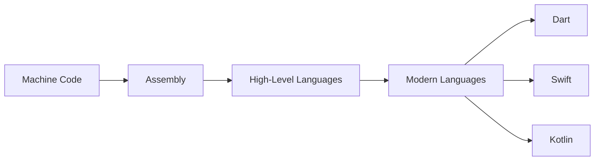
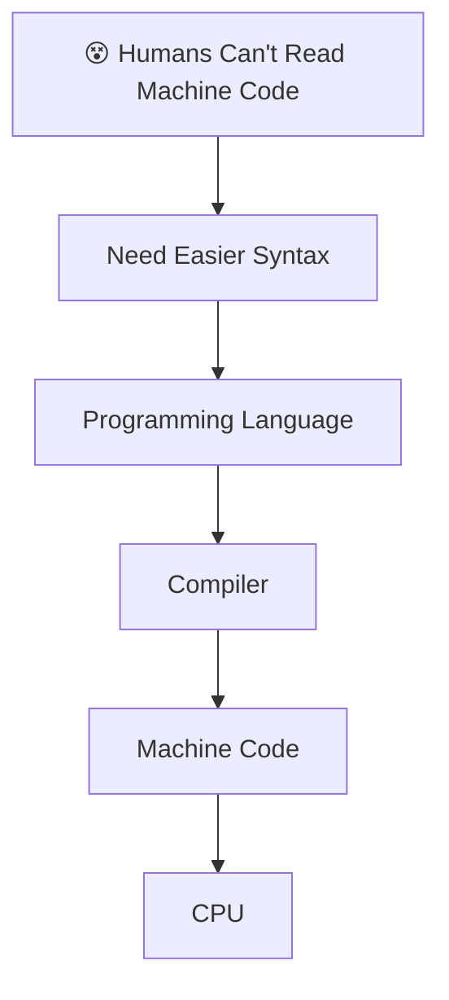

## 📊 Diagram

```mermaid
flowchart TD

    A["👨‍💻 Human (Programmer)"]

    -->|Writes| B["📝 Dart Code<br/>print('Hello');"]

    -->|Compile| C["⚙️ Compiler"]

    -->|Translate| D["💻 Machine Code<br/>010101010..."]

    -->|Execute| E["🧠 CPU"]

    -->|Output| F["🖥️ Hello"]
```

## 📊 Evolution of Programming Languages

```mermaid
flowchart LR

A["Machine Code"]

--> B["Assembly"]

--> C["High-Level Languages"]

--> D["Modern Languages"]

D --> E["Dart"]

D --> F["Swift"]

D --> G["Kotlin"]
```

## 📊 Why Programming Languages Exist

```mermaid
flowchart TD

A["😵 Humans Can't Read Machine Code"]

--> B["Need Easier Syntax"]

--> C["Programming Language"]

--> D["Compiler"]

--> E["Machine Code"]

--> F["CPU"]
```