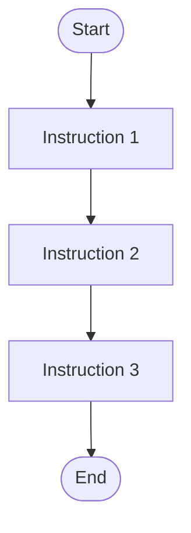
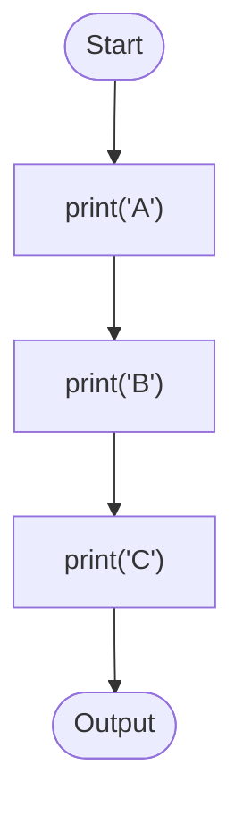

## 📊 Diagram

```mermaid
flowchart TD

A([Start])

--> B["Instruction 1"]

--> C["Instruction 2"]

--> D["Instruction 3"]

--> E([End])
```

---

## 📊 Example

```mermaid
flowchart TD

A([Start])

--> B["print('A')"]

--> C["print('B')"]

--> D["print('C')"]

--> E([Output])
```

---
