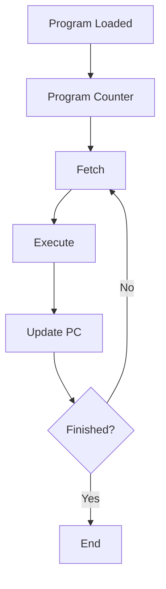

## 📊 Diagram

```mermaid
flowchart TD

A["Program Loaded"]

--> B["Program Counter"]

--> C["Fetch"]

--> D["Execute"]

--> E["Update PC"]

--> F{"Finished?"}

F -- No --> C

F -- Yes --> G["End"]
```

---